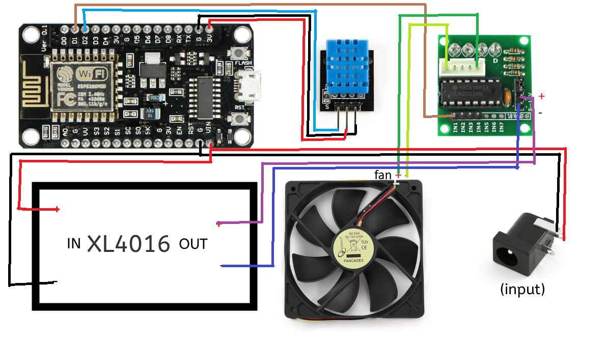

# ESP8266 Smart Fan

A WiFi-connected temperature controlled fan for the summer with a web dashboard.

Built with the parts I already had lying around.

## Demonstration of the fan:

## Features

Fully working Wi-Fi with easy setup

Fan that turns on/off automatically based on the temperature threshold that you set

Live temperature graph updated every 3 seconds

24 hour temperature history with timestamps which resets at midnight (read every 5 minutes)

Downloading the day's temperature data as a CSV

Settings saved across reboots

## How it works

The ULN2003 PCB is used to enable/disable the motor from the ESP8266 using an external 12V source from the boost converter.

I used the ESP8266 as the "brain" in this project, the code uses the WiFiManager library to save the WiFi credentials so after a reboot you don't have to enter them again (nor hardcode them), the whole dashboard page runs on HTML/CSS/JS using the ESP8266 webserver library and interfacing with the ESP to drive the motor, read temperatures and sync clock with NTC for the 24h graph. For reading the temperatures the DHT sensor library from Adafruit is used to read temperatures from the DHT11 sensor in this project (it can read humidity too, although this isn't utilized.)

## Parts

ESP8266 ESP-12E (IdeaSpark)

DHT11 temperature sensor

ULN2003 stepper driver board (used as a fan switch)

XL4016 boost converter (9V in, 12V out for stepper board)

12v 0.3A Gembird 120mm PC fan (3 wire)

9V 1A PSU

BOM: [Download](Assets/BOM.csv)

## Enclosure

**Warning**: I don't have a 3D printer to test this model. I cannot confirm if the tolerances are correct nor if it'll work.

[.STEP Download](Assets/Enclosure.step)

## Wiring

## How to flash

Go to https://espressif.github.io/esptool-js/ 

Go to Program and pick 11520 for baudraute, press connect and select the according COM port.

Download the precompiled .bin file from the repository and select it. Set the flash adress as 0x00000000, leave everything else as-is.

Press program, wait until it says that it'll restart the ESP.

Done!

## How to compile (text guide only)

Open Arduino IDE (download it if you don't already have it)

Download the required libraries (WiFiManager by tzapu, DHT sensor library by adafruit, to get ESP8266 in Arduino IDE 2, use file -> preferences -> paste "https://arduino.esp8266.com/stable/package_esp8266com_index.json" in "Additional board manager URLs" (without parentheses)

Select your com port that the ESP is assigned to and pick ESP-12E as the board.

If everything is set up correctly, press upload and wait until it flashes the ESP.

## First setup:

Video guide:

Text guide:

1. After flashing, wait around 5-10 seconds. In your phone's WiFi settings, a hotspot named "FanControl" should appear. 
2. Connect to it, you'll automatically be sent to a login page. Press connect, pick your network SSID and enter the password.(placeholder)

3. After a bit, you'll be disconnected from the network and the page will close.

4. If everything was successful, then you can access the dashboard from http://fancontrol.local

5. Done! Now, even after a reboot of the ESP the network details will be saved and it'll automatically connect to the network.

## Troubleshooting

ESP reboots and the network hotspot appears again: Incorrect network credentials, try entering them again.

2. Connected to the network successfully, but on no temperature data or graph on the dashboard: Ensure you've connected the temp sensor to D2 (.bin and .ino) or your selected pin (.ino only) If that doesn't work, download the .ino file and uncomment the prints to check where the code exactly loops/fails for you.

## Credits

Thank you to the developer(s) of the WiFiManager, ESP8266, NTPClient libraries for their amazing work making development for such projects easier!

